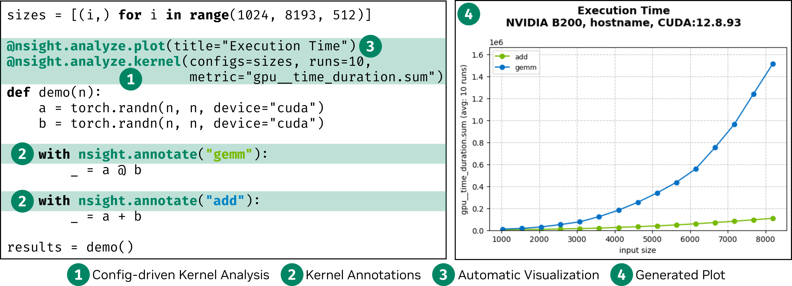

.. SPDX-FileCopyrightText: Copyright (c) 2025 NVIDIA CORPORATION & AFFILIATES. All rights reserved.
.. SPDX-License-Identifier: Apache-2.0

Welcome
========
**Nsight Python** is a Python-first GPU profiling framework that automates performance analysis across multiple kernel configurations using NVIDIA Nsight Compute.

With just a decorator and a context manager, you can benchmark kernel variants, collect detailed architectural metrics, prevent GPU throttling, and generate publication-quality visualizations—all from a single script. No boilerplate. No manual report parsing.

Built for researchers, engineers, and performance enthusiasts who want **real metrics** (not just wall-clock time), **at scale**, with **minimal code overhead**.

Key Features
------------

- Works with **any Python framework** (PyTorch, Triton, etc.)
- Profiles **multiple kernel configurations** with one decorator
- Extracts **detailed NVIDIA Nsight Compute metrics**, not just timings
- Annotates kernel regions using a simple `with nsight.annotate(...)` context
- **Prevents GPU throttling** using real-time NVML temperature monitoring
- Automatically **aggregates and visualizes** performance results
- Outputs structured data (CSV, plots) for publication or analysis
